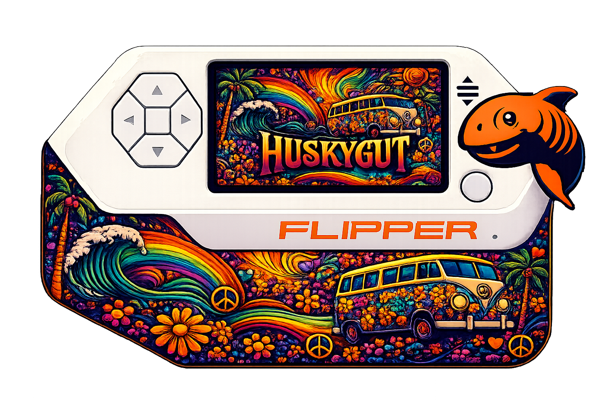

  

<h1 align="center">flipper momentum animation maker</h1>

Create Momentum-compatible Flipper Zero dolphin animations from GIFs with a simple desktop GUI.

---

  

Create custom Momentum dolphin animations without dealing with frame conversion, folder structure headaches, or broken meta files.

Load a GIF, preview the result, tune threshold and contrast using sliders or number inputs, and export a fully working animation pack with real .bm frames.

---

WHAT THIS TOOL DOES

This tool converts an animated GIF into a Momentum-compatible Flipper animation pack.

It handles the annoying parts automatically:

• extracts frames from a GIF  
• resizes frames to 128x64  
• converts frames to 1-bit monochrome  
• lets you tune image quality before export  
• exports real .bm files  
• generates meta.txt and manifest.txt  
• builds the correct Momentum folder structure  

You load a GIF, adjust it until it looks right, and export.

---

FEATURES

• GIF to Flipper animation conversion  
• Live preview  
• Threshold control with slider and number input  
• Contrast control with slider and number input  
• Playback preview  
• Proper Momentum folder structure  
• Real .bm frame export  
• Auto-generated meta.txt and manifest.txt  
• Works on Windows and Linux  

---

OUTPUT STRUCTURE

PackName  
  Anims  
    manifest.txt  
    AnimationName_128x64  
      frame_0.bm  
      frame_1.bm  
      frame_2.bm  
      meta.txt  

The animation folder name automatically becomes:

AnimationName_128x64

The Name field inside manifest.txt matches this exactly so Momentum recognizes it properly.

---

REQUIREMENTS

Python 3.10 or newer  

Required packages  
pillow  
heatshrink2  

---

WINDOWS INSTALLATION

1. Install Python  
Make sure Add Python to PATH is checked  

2. Verify install  
python --version  
or  
py --version  

3. Download script  
flipper_momentum_gif_maker.py  

4. Install packages  
pip install pillow heatshrink2  

If pip fails  
python -m pip install pillow heatshrink2  

5. Run  
python flipper_momentum_gif_maker.py  
or  
py flipper_momentum_gif_maker.py  

---

LINUX INSTALLATION

1. Install Python  
python3 --version  

Install if needed  

Debian Ubuntu  
sudo apt update  
sudo apt install python3 python3-pip python3-tk  

Fedora  
sudo dnf install python3 python3-pip python3-tkinter  

Arch  
sudo pacman -S python python-pip tk  

2. Download script  
flipper_momentum_gif_maker.py  

3. Install packages  
pip3 install pillow heatshrink2  

or  
python3 -m pip install pillow heatshrink2  

4. Run  
python3 flipper_momentum_gif_maker.py  

---

HOW TO USE

1. Open the app  
2. Load a GIF  
3. Watch the preview  
4. Adjust threshold  
5. Adjust contrast  
6. Enter pack name and animation name  
7. Export  

---

WHY THRESHOLD AND CONTRAST MATTER

Flipper animations are tiny and monochrome  

128 pixels wide  
64 pixels tall  
1-bit color  

Bad conversion turns images into garbage.

Use controls to fix it:

Increase contrast if image looks weak  
Adjust threshold if image looks blotchy or faded  

Simple bold images work best.

---

TIPS FOR BEST RESULTS

• use high contrast GIFs  
• use simple shapes  
• avoid tiny details  
• avoid heavy gradients  
• avoid chaotic motion  
• test multiple threshold values  

---

TROUBLESHOOTING

SCRIPT DOES NOT START  
Install required packages  

WINDOWS  
pip install pillow heatshrink2  

LINUX  
pip3 install pillow heatshrink2  

---

GUI CLOSES IMMEDIATELY  
Run from terminal  

WINDOWS  
python flipper_momentum_gif_maker.py  

LINUX  
python3 flipper_momentum_gif_maker.py  

---

ANIMATION LOOKS BLOTCHY  
Adjust threshold  

ANIMATION LOOKS FAINT  
Adjust contrast  

ONLY ONE ANIMATION SHOWS  
Check manifest.txt  

FLIPPER NOT SHOWING ANIMATION  
Check folder structure and names  

---

PROJECT SCOPE

This project does one thing:

create Momentum-compatible Flipper animations without the process being painful

---

PLANNED IMPROVEMENTS

• frame scrubber  
• crop and fit modes  
• FPS control  
• idle frame selection  
• drag and drop support  
• Windows executable  

---

REPOSITORY NAME

flipper-momentum-animation-maker  

---

LICENSE

Use it, modify it, improve it, break it, fix it, make it better
