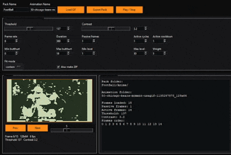

  

  

<h1 align="center">flipper momentum animation maker</h1>

Create Momentum-compatible Flipper Zero dolphin animations from GIFs with a simple desktop GUI.

---

  

Flipper Momentum Animation Maker

Flipper Momentum Animation Maker is a desktop Python tool that turns GIFs into Flipper Zero Momentum-compatible dolphin animations.

It loads a GIF, extracts the frames, resizes them to 128x64, converts them to 1-bit monochrome, and exports the files needed for a Momentum animation pack. That includes the .bm frames, meta.txt, manifest.txt, and the correct folder structure.

This tool is currently made for Momentum-style animation packs. It is not meant to be a universal Flipper animation tool for every firmware.

What it does

Loads GIF files

Extracts frames automatically

Resizes frames to 128x64

Converts frames to 1-bit monochrome

Lets you adjust threshold and contrast before export

Shows a live preview inside the app

Exports .bm frame files

Builds meta.txt and updates manifest.txt

Creates the correct folder structure for Momentum

Can also make a ZIP of the finished pack

Current status

The app is working and exporting correctly.

Frame ordering is fixed.

Manifest formatting is fixed.

Meta.txt active frame handling is fixed.

Animation naming with _128x64 is fixed.

Preview scaling has been improved.

The preview box size was reduced to fit the UI better.

Threshold and contrast controls are working with both sliders and number input.

The app is stable and usable right now, although the preview still is not a perfect match for the Flipper screen.

How to use it

Open the app

Load a GIF

Choose your pack name and animation name

Adjust threshold and contrast until the preview looks right

Set the Momentum animation values you want

Export the pack

Copy the finished pack to your Flipper Momentum asset pack folder

Output

The app exports a folder structure like this

PackName
Anims
AnimationName_128x64
frame_0.bm
frame_1.bm
frame_2.bm
meta.txt

It also updates manifest.txt in the Anims folder so the new animation is included.

Requirements

Python

Pillow

heatshrink2

Why I made this

I wanted a simpler way to make custom Momentum animations without having to manually convert frames and build the files by hand. This started as a small utility and grew into a more complete desktop tool.

Limitations

Right now this is focused on Momentum-compatible animation packs.

The preview is close, but not identical to the way the Flipper screen looks on device.

The code started as a single-file utility, so it will likely be split into separate files as the project grows.

Planned improvements

Better preview accuracy

Frame scrubber

FPS control

Drag and drop support

Windows EXE build

Cleaner code structure split into multiple files

Better demo GIF and screenshots

Thanks

Thanks to everyone who tested it, gave feedback, and pointed out things that needed fixing. The project is still growing, and useful feedback helps a lot.